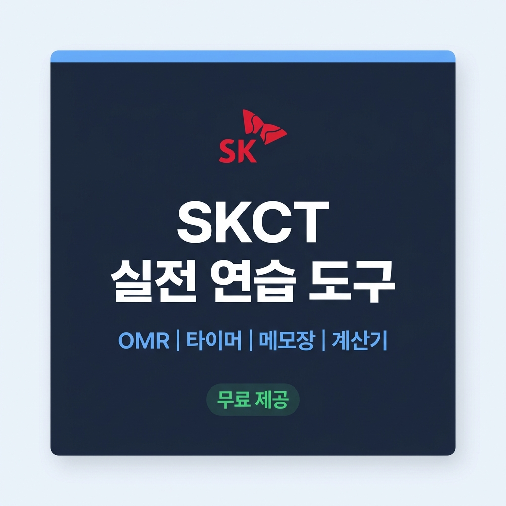

# SKCT 온라인 연습 도구

> SK그룹 SKCT(인적성 검사) 실전 환경을 완벽 재현한 무료 온라인 연습 도구

🔗 **[바로 사용하기 →](https://agenticlab-sh.github.io/skct_tool/)**



---

## ✨ 주요 기능

| 기능 | 설명 |
|------|------|
| **📋 연습용 OMR** | 5지선다 100문항(5과목×20문항) 답안 마킹. 자동 다음 문제 이동. |
| **🕒 다중 페이즈 타이머** | 과목별 시간 + 쉬는시간 자동 전환. 시간 커스터마이징 가능. |
| **✏️ 메모장 & 그림판** | 문제 넘길 때 자동 초기화 (실제 시험과 동일). 브러쉬 시험장 사양. |
| **🧮 키보드 계산기** | 실제 시험과 동일 제한 (Delete, Esc 금지. C 버튼만 허용). |
| **📊 자동 채점** | 정답 입력 후 채점 및 과목별 상세 통계 확인. |
| **📢 실시간 공지** | GitHub에서 `notice.json` 수정만으로 사용자에게 공지 전달. |

---

## 🖥️ 사용 방법

### 1. 답안 작성
- 좌측 **연습용 OMR** 버튼 클릭 → OMR 탭 오픈
- 각 문항 번호를 클릭하여 답 마킹 (자동으로 다음 문제 이동)
- **⏭ 건너뛰기**: 마킹 없이 다음 문제로 이동

### 2. 채점
- **📝 정답 입력 모드로 전환**: 정답을 마킹
- **📊 채점 및 통계 확인**: 결과 확인 (녹색=정답, 적색=오답)
- **📋 과목별 상세 통계**: 과목별 세부 성적 확인

### 3. 타이머 & 레이아웃
- 좌측 **⚙ 설정** 버튼에서 시간 및 영역 비율 조정
- 타이머 ▶ 버튼으로 시작/일시정지

---

## 🗂️ 프로젝트 구조

```
skct_tool/
├── index.html          # 메인 페이지 (SPA)
├── style.css           # 전체 스타일
├── script.js           # 앱 로직 (OMR, 타이머, 계산기 등)
├── notice.json         # 실시간 공지사항 (GitHub에서 직접 수정 가능)
├── images/
│   ├── og-image.png        # SNS 공유용 OG 이미지
│   ├── sk_ci.png           # 파비콘
│   ├── omr_using_image.png # 도움말용 OMR 이미지
│   ├── real_non_omr_image.png # 실제 환경 분할 이미지
│   ├── help_collapsed.png
│   └── help_expanded.png
├── docs/
│   └── SKCT_TOOL_운영가이드.md
├── sitemap.xml         # SEO 사이트맵
├── robots.txt          # 검색 봇 가이드
└── README.md           # 이 문서
```

---

## 📌 기술 스택

- **프론트엔드**: Pure HTML / CSS / JavaScript (프레임워크 없음)
- **호스팅**: GitHub Pages
- **폰트**: [Pretendard](https://github.com/orioncactus/pretendard)
- **분석**: Google Analytics (GA4)
- **방문자 카운터**: [hitscounter.dev](https://hitscounter.dev)

---

## 🔧 공지사항 업데이트 방법

GitHub에서 `notice.json`을 직접 수정하면 사이트에 실시간 반영됩니다.

```json
{
  "show": true,
  "title": "📢 공지 제목",
  "message": "공지 내용 (\\n으로 줄바꿈)",
  "type": "info",
  "updated": "2026-04-03"
}
```

| type | 스타일 |
|------|--------|
| `info` | 💡 파란색 (기본) |
| `warning` | ⚠️ 노란색 |
| `update` | 🆕 초록색 |
| `event` | 🎉 보라색 |

---

## ☕ 후원

이 도구가 도움이 되셨다면 커피 한 잔 후원 부탁드립니다!

👉 [투네이션 후원하기](https://toon.at/donate/foreveryonehappy)

---

## 📧 문의

- **이메일**: drgon28@naver.com
- **GitHub**: [@AgenticLab-SH](https://github.com/AgenticLab-SH)

---

<p align="center">
  <sub>SK 합격하시면 꼭 후원하십쇼!!! ㅋㅋㅋ 🎉</sub>
</p>
